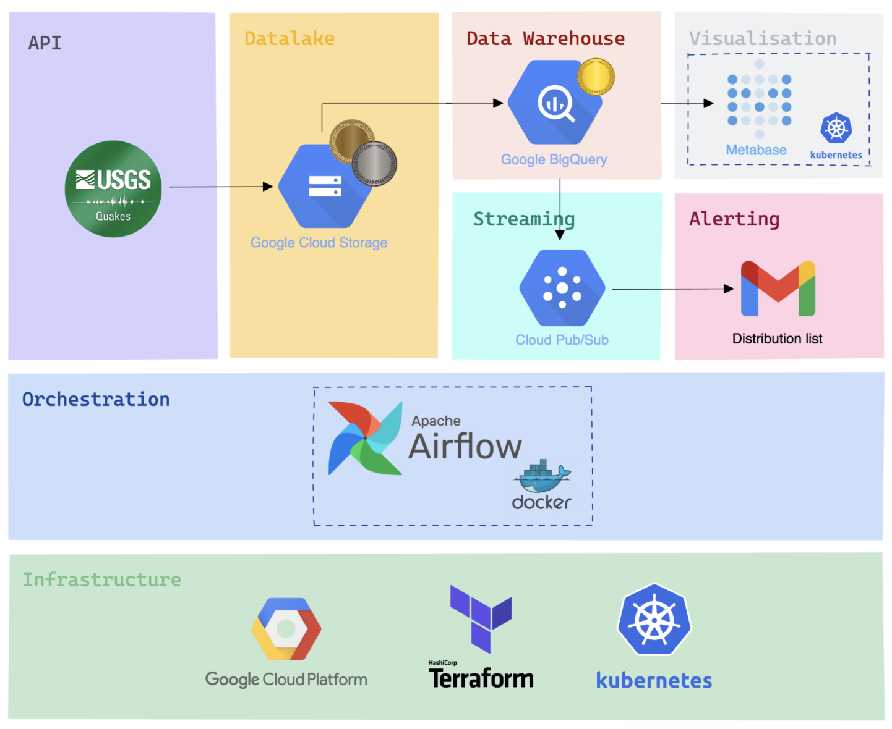
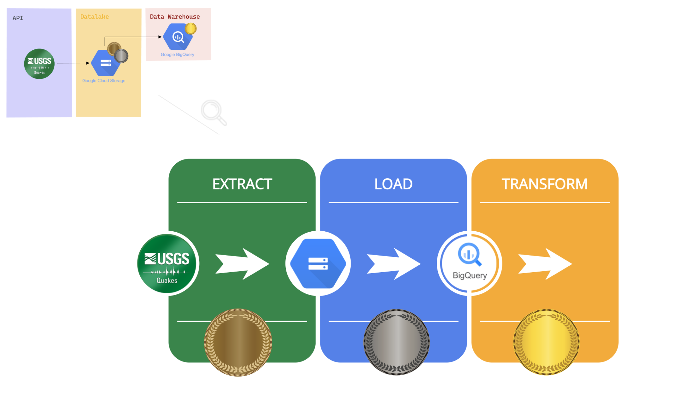
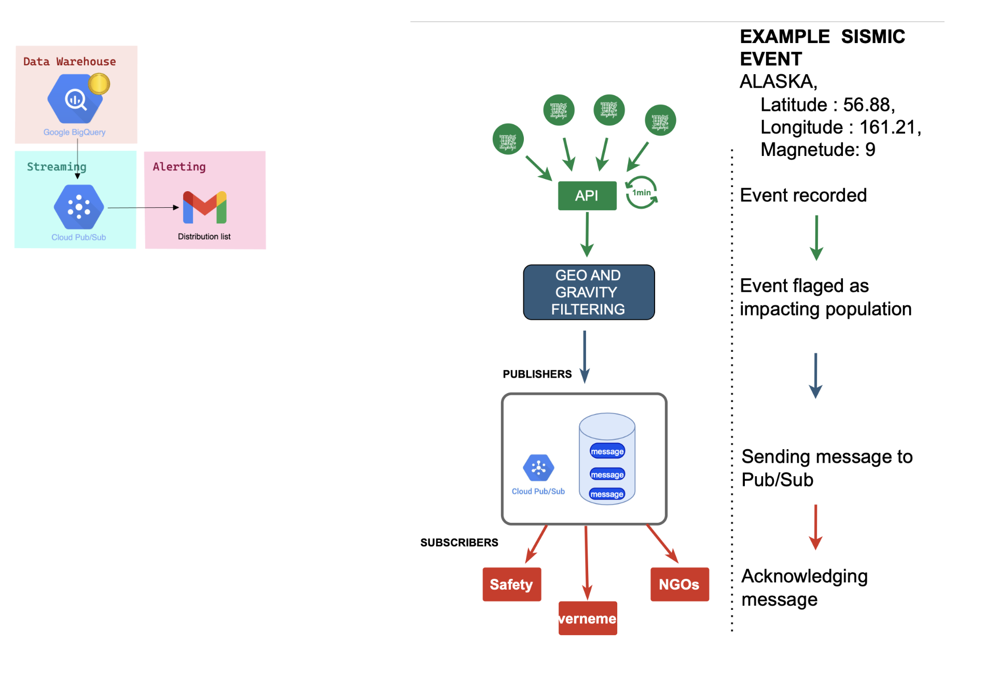
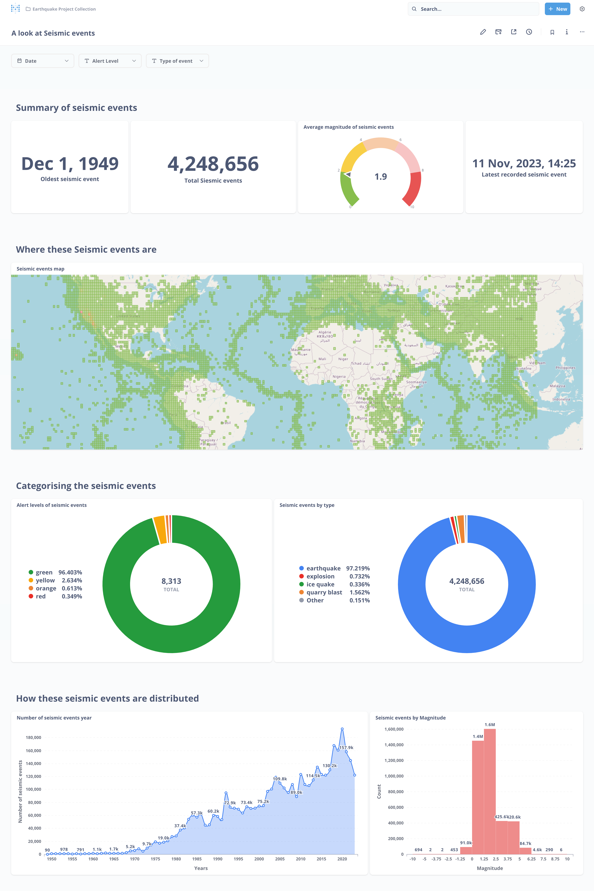
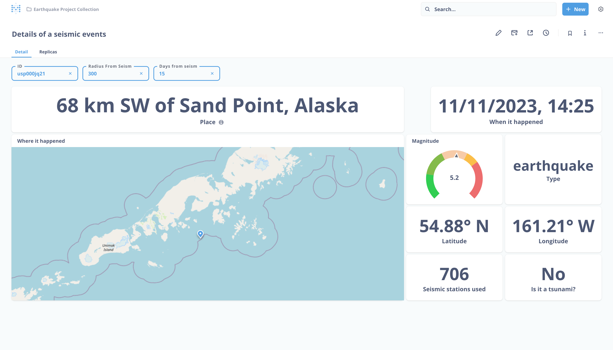

# Seismic events project

This project is the result of a week of development during our [data engineering](https://info.lewagon.com/en/data-engineering) bootcamp [@LeWagon](https://github.com/lewagon).

## Contributors

<table>
   <tbody>
     <tr>
       <td align="center" valign="top" width="14.28%"><a href="https://github.com/messaoudia"> <b>Amin Messaoudi</b></a> <a href="https://github.com/batch1413-earthquake/earthquake-project/commits?author=messaoudia" title="Code">💻</a></td>
       <td align="center" valign="top" width="14.28%"><a href="https://github.com/jalandet"> <b>Juan Alandete</b></a> <a href="https://github.com/batch1413-earthquake/earthquake-project/commits?author=jalandet" title="Code">💻</a></td>
       <td align="center" valign="top" width="14.28%"><a href="https://github.com/maxdelob"> <b>Maxime Delobelle</b></a> <a href="https://github.com/batch1413-earthquake/earthquake-project/commits?author=maxdelob" title="Code">💻</a></td>
       <td align="center" valign="top" width="14.28%"><a href="https://github.com/jlsrvr"> <b>Jules Rivoir</b></a> <a href="https://github.com/batch1413-earthquake/earthquake-project/commits?author=maxdelob" title="Code">💻</a></td>
     </tr>
   </tbody>
 </table>

## Why seismic events ?

### Information

A seismic events is not necessary an earthquake. It can happens for several reason like ice quake, avalanche etc.

### Our goal

With the recent earthquakes in earth we wanted to provide an application that can help local authorities (rescue services, ...) to determine how much people will be impacted by an earthquake to be able to act fast.
Among that we want to have a dashboard (Metabase) that help users to understand and track seismic events.

## Our data

We used USGS api to gather all the data needed.

## Data engineer stack

### Global view

### ELT

### PUB/SUB

### Metabase dashboard

#### All seismic events since 1949

#### Detail of a specific event

