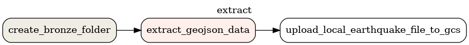
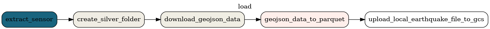
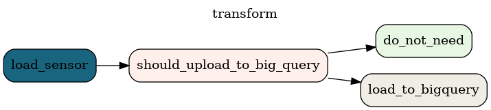

# Seismic events project

This project is the result of a week of development during our [data engineering](https://info.lewagon.com/en/data-engineering) bootcamp [@LeWagon](https://github.com/lewagon).

## Contributors

<table>
   <tbody>
     <tr>
       <td align="center" valign="top" width="14.28%"><a href="https://github.com/messaoudia"> <b>Amin Messaoudi</b></a> <a href="https://github.com/batch1413-earthquake/earthquake-project/commits?author=messaoudia" title="Code">💻</a></td>
       <td align="center" valign="top" width="14.28%"><a href="https://github.com/jalandet"> <b>Juan Alandete</b></a> <a href="https://github.com/batch1413-earthquake/earthquake-project/commits?author=jalandet" title="Code">💻</a></td>
       <td align="center" valign="top" width="14.28%"><a href="https://github.com/maxdelob"> <b>Maxime Delobelle</b></a> <a href="https://github.com/batch1413-earthquake/earthquake-project/commits?author=maxdelob" title="Code">💻</a></td>
       <td align="center" valign="top" width="14.28%"><a href="https://github.com/jlsrvr"> <b>Jules Rivoire</b></a> <a href="https://github.com/batch1413-earthquake/earthquake-project/commits?author=jlsrvr" title="Code">💻</a></td>
     </tr>
   </tbody>
 </table>

## Why seismic events ?

### Information

A seismic event is not necessarily an earthquake. It can happen for several reasons like an ice quake, an explosion etc.

### Our goal

With the recent earthquakes on earth we wanted to provide an application that would help local authorities (rescue services, ...) to determine how many people will be impacted by a seismic event to be able to act fast.
For that we wanted to have a dashboard (Metabase) that would help users to understand and track seismic events.

## Our data

We extracted the data from the USGS api on seismic events.

## Data engineer stack

### Global view

### ELT (Extract|Load|Transform)

- **E**:Extract data from USGS and upload to our bronze layer

Extract dag

 

- **L**:Load data and clean it to store it in our silver layer

Load dag

 

- **T**:Transform data to upload it to our gold layer on Google BigQuery

Transform dag

 

### PUB/SUB

> The Gmail alerting has not yet been developed

### Metabase dashboard

#### All seismic events since december 1949

#### Detail of a specific event

